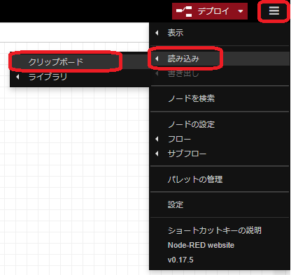
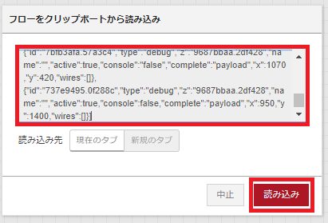
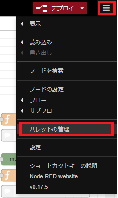
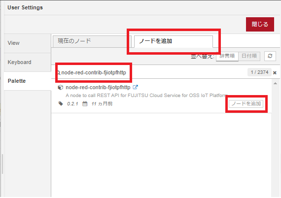
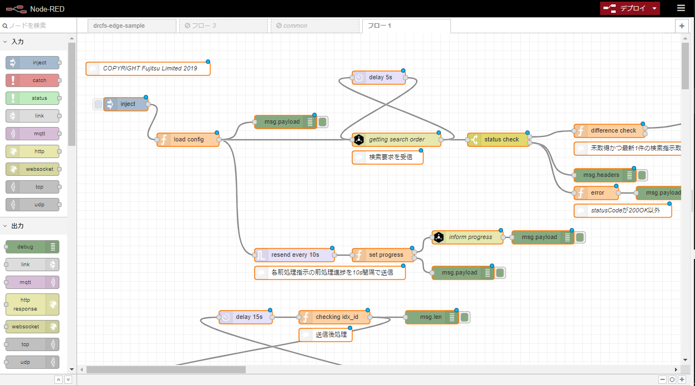
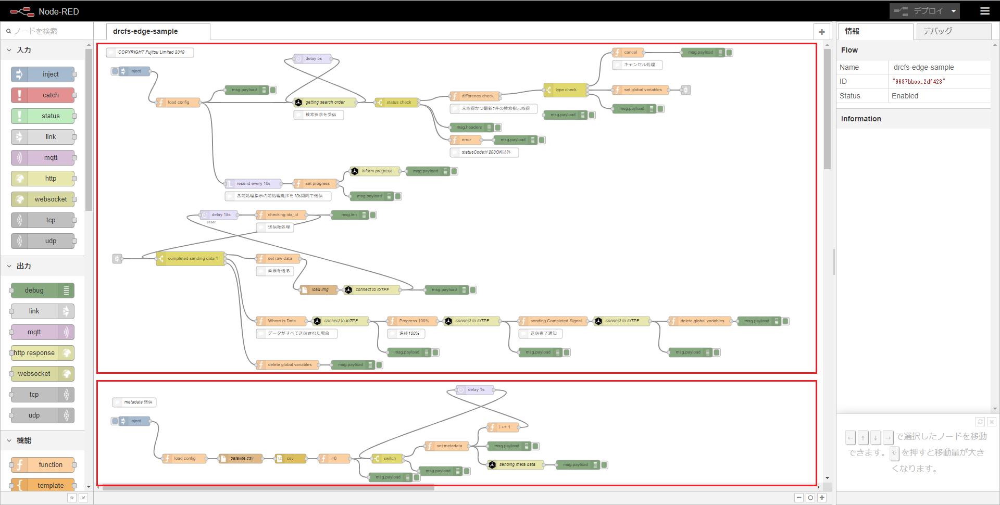

# DRCエッジサンプルアプリケーション

本サンプルアプリはFUJITSU Cloud Service for OSS IoT Platform(以下IoT Platform)の機能であるDRCを活用するサンプルアプリケーションです。

- CentOSの名称およびそのロゴは、CentOS ltdの商標または登録商標または商標です。
- LinuxはLinus Torvalds氏の日本およびその他の国における登録商標または商標です。
- Node-REDはJS Foundationの米国およびその他の国における登録商標または商標です。
- 本サンプルアプリは、修正されたコペルニクス センチネルデータ2018,2019を使用しています。contains modified Copernicus Sentinel data (2018,2019)

## サンプルアプリの概要

本サンプルアプリは、IoT PlatformのDRCを活用するためにエッジ側で行わなければならないことを実施できるサンプルアプリとなっています。OSSであるNode-REDを活用することで、簡単に、かつ、視覚的に利用することができます。

## 免責事項

- 本サンプルアプリを実行することにより、思わぬ誤動作や、予期せぬ課金が発生した場合であっても一切の責任を追いかねます。
- 本サービスの利用、または利用できなかったことにより万が一損害（業務の中断・データの破損/損失・事故などによる損害や第三者からの賠償請求の可能性を含む）が生じたとしても、責任を一切負いかねます。

## 前提条件

本サンプルアプリを実行するにあたって、以下が必要となります。
（1台の端末を用いてエッジコンピュータおよびcurlコマンドの実行環境端末を兼用することもできます。）

- エッジコンピュータ
  - IoT Platformと接続できること
  - Node.jsおよびNode-REDがインストール可能であること
  - 画像や設定ファイルを格納できること
- FUJITSU Cloud Service for OSS IoT Platform
  - 契約されていること
  - ユーザがインターネットよりポータルへログインし設定できること
- curlコマンドの実行環境端末
  - IoT Platformと接続できること
  - ユーザが出力されたJPGファイルを閲覧できること

## 前提知識

本サンプルアプリを利用するにあたって以下の知識を有しているものとします。

- 必要に応じてIoT Platformの公式ドキュメントを参照しながら、APIを発行できること
  - [ドキュメント - IoT Platform](https://iot-docs.jp-east-1.paas.cloud.global.fujitsu.com/ja/manual/index.html)  
- curlコマンドを用いてAPIを発行できること
- Node-REDを用いて簡単なアプリケーションを開発できること
  - [ドキュメント：Node-RED日本ユーザ会](https://nodered.jp/docs/)

## 動作確認環境

エッジコンピュータは以下の環境にて動作の確認をしております。

- CentOS 6.10
- Node.js v9.2.1
- npm v5.5.1

## 本サンプルアプリのユースケースについて

本サンプルアプリは、宇宙に点在する人工衛星をエッジとして、人工衛星に蓄積された画像を効率よく利活用する例となっています。（尚、本シナリオは仮想のユースケースであり、実際の人工衛星に適用した事例ではありません。ご了承願います。）

本シナリオにおいて、人工衛星が複数打ち上げられています。打ち上げられた人工衛星は地上の画像を撮影し人工衛星内に蓄積しています。しかしながら、地上と人工衛星の間の帯域が限られており、常に最新の画像をすべて取得することができません。そこで、本機能を活用し、撮影したメタデータのみを地上に送信し、人工衛星に蓄積された画像を検索できるようにしました。これにより、過去に遡って必要な画像データを効率よく収集することができるようになります。

今回、人工衛星は検索時のキーとなるメタデータとして撮影した日時情報と緯度経度情報(geo_lat,geo_lng)を送信するものとします。また利用者は今回蓄積されたメタデータを基に、北緯(geo_lat)が36.12427601168043度、東経(geo_lng)が138.77760353347315度の画像を検索し取得するものとします。1時間経過しても収集できなかった場合は指示を打ち切るものとします。尚、エッジである人工衛星に蓄積できるデータは7日分とします。

## 全体構成

本サンプルアプリでは、DRCを利用するために必要な[メタデータ収集アプリ]と[前処理アプリ]を実装しています。(検索要求を行う[活用システムアプリ]については実装していません。)
[メタデータ収集アプリ]では、人工衛星(エッジ)にて生成された画像から作成したメタデータを送信します。[前処理アプリ]では、人工衛星(エッジ)がDRCによる検索指示を読み取ります。
DRCの全体概要については[IoT Platform DRC(オンデマンドデータ収集) ユーザーガイド](https://iot-docs.jp-east-1.paas.cloud.global.fujitsu.com/ja/manual/index.html)をご参照ください。

## 準備方法

### IoT Platformの設定方法

IoT Platformのポータルサイトにログインします。操作方法の詳細は[IoT Platformドキュメント](https://iot-docs.jp-east-1.paas.cloud.global.fujitsu.com/ja/manual/index.html)をご参照ください。

#### リソースの設定

まず、DRC機能の設定に必要なリソースを作成します。
[リソース]タブをクリックし、[追加]ボタンでリソース追加画面を表示します。
以下の設定を行い、[追加]ボタンでリソースを追加します。

- リソース種別：[リソース]を選択
- リソースパス：DRCで利用するリソースのプレフィクスとなる任意の名前(ここでは[drcfs])を入力
- リソース名：任意の名前を入力(省略可)
- データ形式：[JSON]を選択
- コメント：任意のコメントを入力(省略可)
- 保存期間(１～9999日)：保存したい期間(ここでは[7])を入力

上記リソースと同様に、メタデータの格納リソース、バイナリデータ格納リソースを以下の設定で追加します。

メタデータの格納リソース

- リソース種別：[リソース]を選択
- リソースパス：[プレフィクス/meta/keys/パラメータ名]となる、メタデータとして登録したいパラメータ(ここでは[drcfs/meta/keys/geo_lat]および[drcfs/meta/keys/geo_lng])を入力
- リソース名：任意の名前を入力(省略可)
- データ形式：[JSON]を選択
- コメント：任意のコメントを入力(省略可)
- 保存期間(１～9999日)：保存したい期間(ここでは[7])を入力

バイナリデータ格納リソース

- リソース種別：[リソース]を選択
- リソースパス：任意の名前(ここでは[drcfs/img])を入力(データ形式を[バイナリ]にすると自動的に先頭に[_bin/]がつけられる)
- リソース名：任意の名前(省略可、ここでは[DRCFS画像格納リソース])を入力
- データ形式：[バイナリ]を選択
- コメント：任意のコメントを入力(省略可)
- 保存期間(１～9999日)：保存したい期間(ここでは[7])を入力

#### アクセスコードの設定

次に[アクセスコード]タブをクリックし、[追加]ボタンでアクセスコード追加画面を表示します。
以下の設定を行い、[追加]ボタンでアクセスコードを追加します。

- アクセスコード：任意の名前(ここでは[drcfsdevclient])を入力
- アクセスコード名：任意の名前(省略可、ここでは[DRCFSアクセスコード])を入力
- アクセスプロトコル：[設定無]を選択
- 証明書：設定なし
- コメント：任意のコメントを入力(省略可)
- リソース検索で先ほど作成したプレフィクス(ここでは[drcfs])およびバイナリリソース(ここでは[_bin/drcfs/img])を検索し、一覧でチェックを入れて[▼追加]をクリック
- 追加されたリソースのCDL、P、G、U、Rにチェックを入力

#### DRC機能の設定

[分散設定]タブをクリック後、[DRCFS]タブをクリックしてDRCFS設定画面を表示します。
以下の設定を行い、[更新]ボタンで設定を反映します。これにより、DRCFSに必要なリソースが自動的に設定されます。

- 有効/無効：[有効]を選択
- リソースパス：先ほど作成したリソース(ここでは[drcfs])を入力
- リソース名：リソースパスを選択すると自動で入力
- アクセスコード：リソースパスを選択すると自動で入力
- アクセスコード名：リソースパスを選択すると自動で入力

更新してから設定の反映までに10分程度かかる場合があります。
[リソース]タブで[検索]ボタンをクリックし、必要なリソースが作られているか確認します。
システムにより作られるリソースは以下です。(登録したプレフィクスが[drcfs]の場合)

- drcfs/meta/gws
- drcfs/meta/publish
- drcfs/meta/request/search
- drcfs/meta/response/search
- drcfs/meta/response/preprocessed

#### curlコマンドによるリソース作成

curlコマンドの実行環境端末から、以下のcurlコマンドでエッジ情報を登録します。ここではエッジの名前を[idx-001]として登録します。URIの詳細はポータルの[リソース]タブでも確認できます。

```Console
curl -i -X PUT -H ’Authorization: Bearer drcfsdevclient' -d '{
    "gw_id": "idx-001"
}' '<Base URL>/v1/<Tenant ID>/drcfs/meta/gws'
```

コマンドを発行した後、しばらくしてからポータルの[リソース]タブで必要なリソースが作られているか確認します。
システムにより作られるリソースは以下です。(登録したプレフィクスが[drcfs]、エッジの名前が[idx-001]の場合)

- drcfs/meta/confirm/idx-001
- drcfs/request/clients/idx-001
- drcfs/response/sent_flags/idx-001
- drcfs/response/progress/idx-001

以上でリソースの設定は終了です。

### Node-RED実行環境の準備

LinuxにNode-REDをインストールする方法については、Node-RED公式ドキュメント[ローカルでNode-REDを実行する](https://nodered.jp/docs/getting-started/local)をご参照ください。
また、Windowsでのインストールの場合は[Windowsで実行する](https://nodered.jp/docs/getting-started/windows)をご参照ください。

### Node-REDサンプルの展開方法

ここでは、CentOSにNode-REDをインストールした場合の方法を記載します。他OSの場合は必要に応じてディレクトリなどを置き換えて実施してください。

提供しているサンプルの一覧は以下です。

- /src/drcfs-edge-sample.json
  - Node-REDのフロー  
- /src/setting.js
  - Node-REDの設定ファイル  
- /src/config.properties
  - 外部変数の設定ファイル  
- /src/satellite.csv
  - メタデータを規定したファイル  
- /src/各種jpegファイル
  - 衛星写真（６枚）

setting.js, config.properties, satellite.csv, jpegファイル6枚をNode-REDのホームディレクトリ（デフォルトは/root/.node-red)に格納します。
config.propertiesの読み込みができるようにするため、以下のコマンドによりproperties-parserをインストールします。

```Console
npm install properties-parser
```

config.propertiesの各種変数を適当な値に設定してください。
本書での設定では以下のような値となります。

```Console
 #リソースパス関係
BASEURL=http://<zone>.fujitsu.com
IOTPF_TENNANT_ID=ご契約のテナントID
IOTPF_DRCFS_PREFIX=drcfs
GW_ID=idx-001

IOTPF_DRCFS_ACCESSCODE=drcfsdevclient
IOTPF_DATA_RESOURCE=_bin/drcfs/img
IMG_PATH=/root/.node-red
```

以上を実施した後、以下のコマンドでNode-REDを起動します。

```Console
node-red
```

次に、```drcfs-edge-sample.json```を読み込みます。```drcfs-edge-sample.json```をメモ帳などで開きコピーします。フローエディタにて画面右上の[三]から[読み込み]->[クリップボード]を選択します。



中央の入力欄にWindowsの場合[Ctrl+V]、Macの場合[command+V]にて貼付け、[読み込み]を選択します。



任意の箇所でクリックするとフローがフローエディタ上に展開されます。

### IoT Platformノードをインストールする

フローエディタにて画面右上の[三]から[パレットの管理]を選択します。



[ノードを追加]タブを選択し、```node-red-contrib-fjiotpfhttp```を入力します。[node-red-contrib-fjiotpfhttp]がIoT Platform用のノードです。[ノードを追加]を選択するとインストールされます。



[load config]ノード内にconfig.propertiesのアドレスが記載されているので環境に合わせて修正してください。
最後にフローエディタにて画面右上の[デプロイ]をクリックするとフローが実行されます。



## 実施手順

### メタデータを登録する

Node-REDにインターネットブラウザからアクセスし、読み込んだdrcfs-edge-sampleの画面を開きます。画面右上の[デプロイ]ボタンが赤色になっている場合は、クリックしてデプロイしてください。
画面下のノードがメタデータを登録するノードです。下側のinjectノードをクリックすると、メタデータが登録されます。



登録されたメタデータを確認したい場合は、curlコマンド実行環境で以下のコマンドを実行してください。

```Console
curl -X GET -H 'Authorization: Bearer drcfsdevclient'  '<Base URL>/v1/<Tenant ID>/drcfs/meta/confirm/idx-001/_past' | jq .
```

### データの検索を実施する

画面上のノードがデータ検索要求が来た際にデータを送信するノードです。
上側のinjectノードをクリックすると、データ検索要求の待ち受けが開始されます。
データ要求が来ていない場合は定期的な監視ログのみが表示されます。
curlコマンド実行環境にて、データ検索要求を送信します。[req_id]は任意の文字列ですが、1つの要求に対し一意である必要があります。(一度使用した[req_id]は他の要求の際には使わないようにしてください)

```Console
curl -i -X PUT -H 'Authorization: Bearer drcfsdevclient' -d '{
  "type": "search",
  "req_id": "abcdefghijk",
  "preproc": "gettingpicture",
  "keys" : [
    "geo_lng",
    "geo_lat"
  ],
  "filters" : [
    "value eq 138.77760353347315",
    "value eq 36.12427601168043"
  ],
  "verbose" : true
}' '<Base URL>/v1/<Tenant ID>/drcfs/request/search'
```

データ検索要求が送信されてしばらく経つと、Node-RED側でデータ検索要求を確認して指示されたメタデータを持つ画像の送信を実施します。
検索完了通知を取得する場合は以下のcurlコマンドを実行します。

```Console
curl -X GET -H 'Authorization: Bearer drcfsdevclient'  '<Base URL>/v1/<Tenant ID>/drcfs/response/search/_present' | jq .
```

レスポンスのステータスがsucceededとなっていれば送信が完了しています。

#### 送信されたデータを確認する

以下のcurlコマンドを実行すると、送信したデータがどこに格納されたかの情報が取得できます。このシステムでは_bin/drcfs/imgのリソースに格納したことが記述されています。

```Console
curl -X GET -H 'Authorization: Bearer drcfsdevclient'  '<Base URL>/v1/<Tenant ID>/drcfs/response/preprocessed/_present' | jq .
```

以下のコマンドでバイナリリソースに保存されているデータの一覧が表示できます。

```Console
curl -X GET -H 'Authorization: Bearer drcfsdevclient'  '<Base URL>/v1/<Tenant ID>/_bin/drcfs/img/_past' | jq .
```

一覧のサンプルは以下です。

```Console
[
  {
    "name": "_bin/drcfs/img/_past(20191225T090148.621Z)",
    "content_type": "application/octet-stream"
  },
  {
    "name": "_bin/drcfs/img/_past(20191223T003709.745Z)",
    "content_type": "application/octet-stream"
  },
  {
    "name": "_bin/drcfs/img/_past(20191223T003654.625Z)",
    "content_type": "application/octet-stream"
  }
]
```

画像として保存したい場合は、以下のように、```name```の値に直接アクセスし保存先のファイル名を指定してcurlコマンドを発行してください。

```Console
curl -X GET -H 'Authorization: Bearer drcfsdevclient'  '<Base URL>/v1/<Tenant ID>/_bin/drcfs/img/_past(20191225T090148.621Z)' > 20191225T090148.621Z.jpg
```

保存された20191225T090148.621Z.jpgをファイルビューアーなどで開くことで、検索要求に合致したデータを取得できていることが確認できます。
